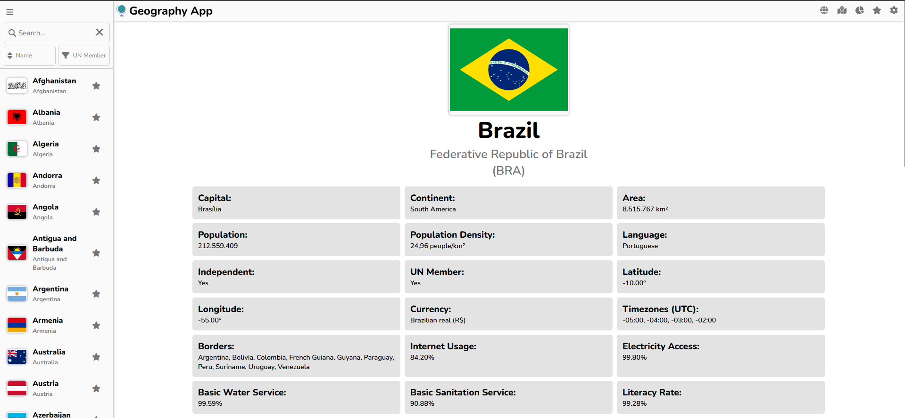
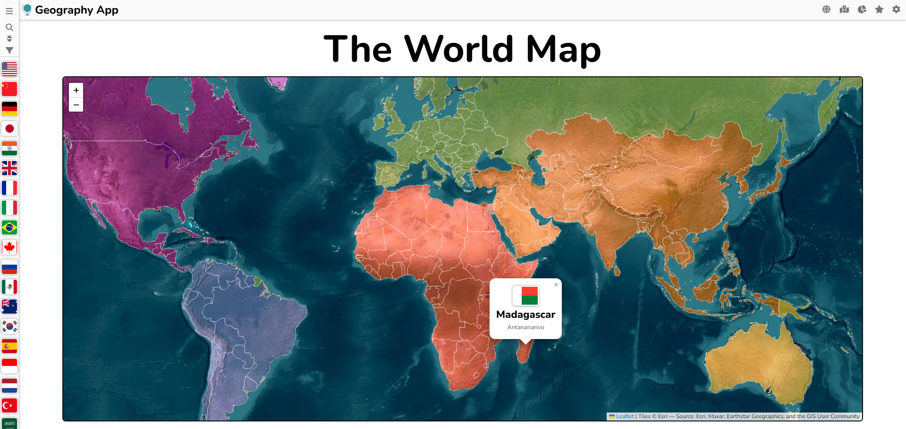
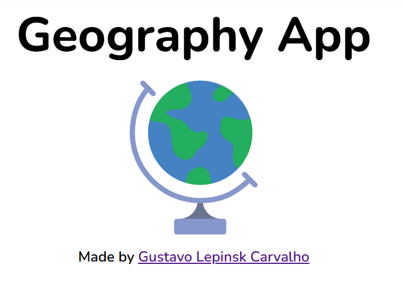

# Geography App 


## Full Version

- [App](https://gustavol07.github.io/Geography-App/)

## Features

- **Country Explorer:** Browse a comprehensive list of countries with detailed information.
- **Compare Countries:** Select and compare two countries side by side across various metrics.
- **World Map:** Visualize countries on an interactive map and click to view details.
- **Favorites:** Mark countries as favorites for quick access.

## Screenshots



```
## Getting Started

### Prerequisites

- [Node.js](https://nodejs.org/) (v16+ recommended)
- [npm](https://www.npmjs.com/) or [yarn](https://yarnpkg.com/)

### Installation

1. **Clone the repository:**
   ```sh
   git clone https://github.com/GustavoL07/geography-app.git
   cd geography-app
   ```

2. **Install dependencies:**
   ```sh
   npm install
   # or
   yarn install
   ```

3. **Start the development server:**
   ```sh
   npm run dev
   # or
   yarn dev
   ```

4. **Open your browser:**  
   Visit [http://localhost:5173](http://localhost:5173)

## Technologies Used

- **React** 
- **TypeScript**
- **Vite** 

## Credits

Made by [Gustavo Lepinsk Carvalho](https://github.com/GustavoL07)
- [Rest Countries](https://restcountries.com/)
- [World Bank API](https://www.worldbank.org/ext/en/home)

## License

MIT License

---

> _Feel free to contribute or open issues!_
